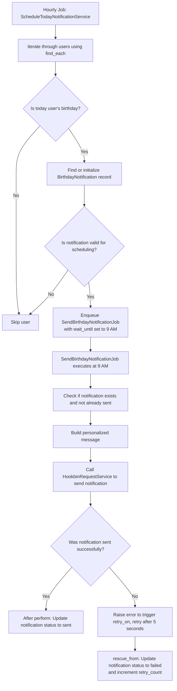
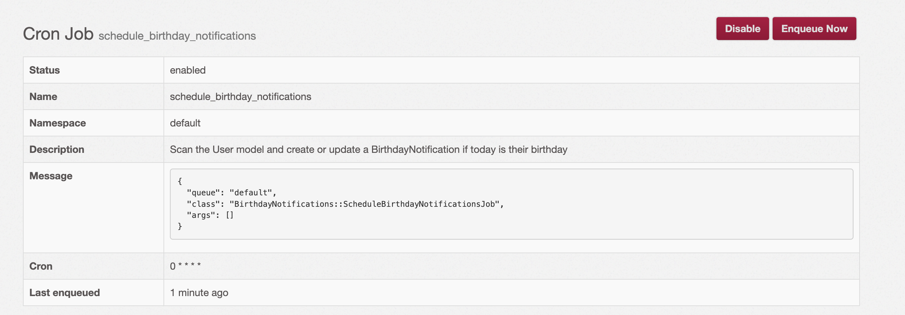
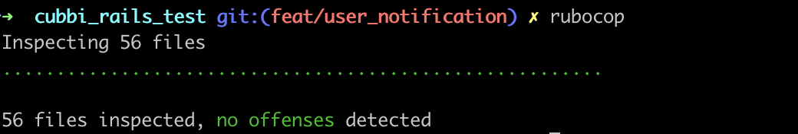
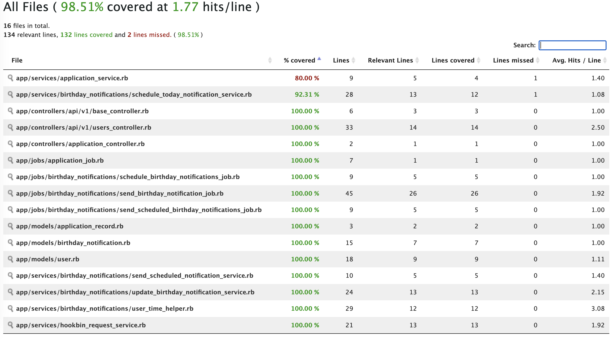

# Cubbi Test

Cubbi Test is a Ruby on Rails application designed to send personalized happy birthday messages to users at exactly 9 AM in their local time zone. Whether a user is in New York, Melbourne, or anywhere in the world, they will receive the message “Hey, {full_name} it’s your birthday” right on time.

**Table of Contents**

- [Cubbi Test](#cubbi-test)
  - [Notification flow](#notification-flow)
  - [🔥🔥 How Sidekiq Works for This System](#-how-sidekiq-works-for-this-system)
    - [Job Resilience Explained](#job-resilience-explained)
    - [How It Works](#how-it-works)
    - [=\> Key Benefits for Scalability and Reliability](#-key-benefits-for-scalability-and-reliability)
    - [Scalability and Performance of Sidekiq](#scalability-and-performance-of-sidekiq)
      - [Example Scenario](#example-scenario)
      - [Real-World Considerations](#real-world-considerations)
    - [Scalability in Your Code](#scalability-in-your-code)
  - [Features](#features)
  - [Overview](#overview)
  - [Technologies Used](#technologies-used)
  - [Installation and Setup](#installation-and-setup)
  - [API Endpoints](#api-endpoints)
  - [Birthday Message Scheduling](#birthday-message-scheduling)
  - [Screenshots:](#screenshots)

---

## Notification flow

- Flow Chart



## 🔥🔥 How Sidekiq Works for This System

- Enqueueing Tasks:

  > When the ScheduleTodayNotificationService detects that it’s a user’s birthday, it enqueues a job (SendBirthdayNotificationJob) using Sidekiq. The job is set with a specific execution time using the set`(wait_until: scheduled_time(user))` method, so that it runs precisely at 9 AM in the user's local time.
  > Efficient Scheduling:
  > Sidekiq schedules these jobs in its internal queue without blocking the scheduling service. This allows the scheduling process to quickly complete its scan and offload work to the background.

- Concurrent Job Processing:

  Worker Threads:

  > Sidekiq runs a pool of worker threads that can process multiple jobs concurrently. This means that even if hundreds or thousands of notifications need to be sent, Sidekiq can handle them in parallel without waiting for each job to complete sequentially.
  > Horizontal Scalability:
  > If the load increases (for example, more users or more notifications on the same day), you can scale out by adding more Sidekiq processes or servers. This distributed processing model ensures that the system remains responsive under high demand.

  Error Handling and Retries:

  > Automatic Retry Mechanism:
  > If a job fails (e.g., the external API call to send the notification fails), Sidekiq’s built-in retry mechanism comes into play. The job is automatically retried after a specified delay (5 seconds in this case) until it either succeeds or the maximum number of retries is reached.
  > Custom Error Management:
  > The job uses rescue_from to catch exceptions, update the notification status to failed, and increment the retry count. This granular error handling ensures that failures are tracked and managed without disrupting the processing of other jobs.

  Non-blocking and Asynchronous Processing:

  > Offloading Long-running Tasks:
  > By using Sidekiq, the system offloads potentially time-consuming tasks like sending API requests to a background process. This asynchronous processing means the main application (or scheduling job) isn’t blocked by slow network responses or temporary service outages.

  Improved Response Times:

  > Since the main user scan and job scheduling are fast and non-blocking, the overall system remains performant even when handling many notifications.

  Resource Optimization:

  - Batch Processing and Memory Efficiency:
    > In combination with ActiveRecord’s find_each, Sidekiq allows for processing users in manageable batches. This minimizes memory overhead while ensuring that each enqueued job is lightweight.
  - Load Distribution:
    > Sidekiq’s architecture distributes the workload across available threads and servers, making efficient use of system resources and preventing any single process from becoming a bottleneck.

### Job Resilience Explained

**What It Means:**

- **Resilience:** The system is designed to handle rare, unexpected failures (such as a Redis data loss) by ensuring that no scheduled notifications are permanently lost.
- **Reliability:** Even if the in-memory job queue (Redis) suffers data loss or a similar issue, your persistent database records (in the `birthday_notifications` table) retain the pending notifications. This allows the system to recover and reprocess those notifications.

---

### How It Works

1. **Persistent Storage of Notifications:**

   - When a birthday notification is scheduled, a record is created or updated in the database with a status of `scheduled`.
   - This database record acts as a reliable source of truth for notifications that need to be sent, independent of the state of Redis.

2. **Dedicated Re-enqueue Job:**

   - The job `SendScheduledBirthdayNotificationsJob` serves as a safety net.
   - This job periodically invokes the `SendScheduledNotificationService`, which scans the database for all notifications with the status `scheduled`.

3. **Reprocessing Pending Notifications:**

   - The `SendScheduledNotificationService` iterates through each `BirthdayNotification` record with status `scheduled` and re-enqueues the sending job.
   - For each notification found, it re-enqueues the `SendBirthdayNotificationJob` to attempt sending the notification again.
   - **Why This Matters:**
     If a job was lost or not processed due to a temporary Redis outage or any other issue, the database record remains. The re-enqueue job can pick it up and ensure the notification is eventually sent.

4. **Error Handling and Retries:**
   - The actual sending job (`SendBirthdayNotificationJob`) includes mechanisms to handle failures:
     - It retries automatically on errors (with a 5-second delay between attempts).
     - It updates the notification status to `failed` if it eventually fails after several retries.
   - This robust error handling, combined with periodic re-enqueueing, guarantees that every notification is either successfully sent or properly flagged for review.

### => Key Benefits for Scalability and Reliability

- **Data Reliability:**
  Persistent database records provide a fallback in case of transient failures in the job queue (Redis). This means that even if in-memory job data is lost, no notification request is permanently lost.

- **Automated Recovery:**
  The dedicated re-enqueue job continuously monitors and picks up any pending notifications, ensuring they are reprocessed. This minimizes manual intervention and helps maintain service quality.

- **Improved System Resilience:**
  By decoupling the scheduling (data persistence) from job processing (in-memory execution), your system can recover gracefully from infrastructure hiccups. This design is crucial for maintaining high availability and reliability, even under unexpected failure scenarios.

- **Scalability:**
  As the system scales (with more users and notifications), this resilient design ensures that all notifications are accounted for and processed, reducing the risk of data loss and ensuring timely delivery.

### Scalability and Performance of Sidekiq

Sidekiq is designed for high concurrency and efficient job processing. With a properly configured infrastructure and sufficient worker processes, Sidekiq can handle an enormous number of jobs per day. Let's break down an example to illustrate this:

#### Example Scenario

- **Assumptions:**

  - **Job Processing Time:** Each job takes around 100 milliseconds to complete (including tasks like API calls and database updates).
  - **Worker Threads:** The system is configured with 50 worker threads running concurrently.

- **Calculations:**
  - **Per Worker:**
    A single worker can process about 10 jobs per second (since 1 second / 0.1 second ≈ 10).
  - **Total Throughput:**
    With 50 workers, the system can process roughly 50 x 10 = **500 jobs per second**.
  - **Per Minute:**
    500 jobs/second \* 60 seconds = **30,000 jobs per minute**.
  - **Per Hour:**
    30,000 jobs/minute \* 60 minutes = **1,800,000 jobs per hour**.
  - **Per Day:**
    1,800,000 jobs/hour \* 24 hours = **43,200,000 jobs per day**.

#### Real-World Considerations

- **Job Complexity:**
  The actual processing time per job might vary depending on the complexity of the task (e.g., network latency when calling external APIs like Hookbin, or slower database updates). Even if the jobs take longer, Sidekiq's parallel processing capabilities ensure high throughput.

- **Infrastructure Scaling:**
  The above numbers assume a single server with 50 concurrent workers. Sidekiq scales horizontally, meaning you can add more servers to distribute the workload. For instance, with two servers running 50 workers each, the capacity doubles.

- **Optimized Resource Usage:**
  Utilizing techniques like batch processing (using ActiveRecord's `find_each`) and decoupling scheduling from processing ensures that the system uses resources efficiently, even during peak loads.

- **Fault Tolerance:**
  The resilience mechanisms (e.g., retry policies and re-enqueue jobs) guarantee that even if some jobs fail or if there's a temporary data loss in Redis, no scheduled notification is lost, and all jobs are eventually processed.

### Scalability in Your Code

The scalability of your system is reflected in several key areas of your code:

1. **Batch Processing with `find_each`:**

   - **Code:**

     ```ruby
     User.find_each do |user|
       # process each user
     end
     ```

   - **Explanation:**
     Using `find_each` allows you to process users in small batches rather than loading all users into memory at once. This reduces memory overhead and optimizes database querying when handling a large number of users.

2. **Separation of Scheduling and Sending Notifications:**

   - **Scheduling Code:**

     ```ruby
     notification = BirthdayNotification.find_or_initialize_by(
       user: user,
       birthday: today_local(user)
     )

     if notification.save! && should_schedule?(notification)
       SendBirthdayNotificationJob.set(wait_until: scheduled_time(user))
                                  .perform_later(notification.id)
     end
     ```

   - **Re-enqueue (Job Resilience) Code Example:**

     ```ruby
     module BirthdayNotifications
       class SendScheduledBirthdayNotificationsJob < ApplicationJob
         queue_as :default

         def perform
           BirthdayNotifications::SendScheduledNotificationService.call()
         end
       end
     end
     ```

   - **Explanation:**
     By separating the scheduling (which creates or updates the notification records) from the sending of notifications, your system can handle each task independently. This separation allows the lightweight scheduling process to quickly offload heavy tasks to background jobs. The dedicated re-enqueue job helps ensure that any scheduled notifications that might have been lost due to transient failures (e.g., a Redis outage) are reprocessed, boosting overall system resilience and scalability.

3. **Leveraging Sidekiq and Multi-threaded Workers:**

   - **Sending Notification Code:**

     ```ruby
     module BirthdayNotifications
       class SendBirthdayNotificationJob < ApplicationJob
         queue_as :default

         retry_on StandardError, wait: 5.seconds, attempts: BirthdayNotification::MAX_RETRIES

         after_perform do |job|
           update_notification_status((job || self).arguments.first, :sent)
         end

         rescue_from(StandardError) do |exception, job|
           update_notification_status((job || self).arguments.first, :failed, exception)
           raise exception
         end

         def perform(notification_id)
           #...
         end
       end
     end
     ```

   - **Explanation:**
     Sidekiq enables concurrent processing by using multiple worker threads. This allows your system to process many jobs simultaneously. With enough workers and servers, your system can scale horizontally to handle millions of jobs per day. The built-in retry mechanism and error handling further enhance reliability by automatically reprocessing failed jobs.

## Features

- **User Management API:**
  - **POST /users:** Create a new user.
  - **DELETE /user:** Delete an existing user.
- **User Attributes:**
  Each user record includes a first name, last name, birthday date, and location (the location format is flexible).
- **Timezone-Aware Scheduling:**
  The system schedules a birthday message to be sent at 9 AM based on each user’s local time.
- **Reliable Message Delivery:**
  In the event of downtime (e.g., the service being unavailable for a day), the system is capable of recovering and sending any unsent birthday messages.
- **Extensible Architecture:**
  Designed with a high level of abstraction so that future features (like sending happy anniversary messages) can be added with minimal changes.
- **Background Job Processing:**
  Utilizes Sidekiq for processing jobs asynchronously to handle message scheduling and delivery.
- **Seed Data Management:**
  Uses the Seedbank gem for managing seed data.

## Overview

- **Rails & Sidekiq**

  - Built on Rails with Sidekiq for background job processing.

- **API Endpoints**

  - Provides simple endpoints for creating and deleting users.

- **User Model**

  - **Attributes:** first name, last name, birthday date, email, and location.
  - **Validations:** unique email, valid email format, presence of birthday date.
  - **Callback:** triggers update of birthday notifications when `birthday_date` is updated.

- **BirthdayNotification Model**

  - **Association:** belongs to a User.
  - **Unique Constraint:** one notification per user per birthday (unique on `user_id` & `birthday`).
  - **Enum Status:** scheduled, sent, failed, cancelled.
  - **Tracking:** includes a `retry_count` with a maximum defined by `MAX_RETRIES`.
  - **Constants:**
    - `MAX_RETRIES`
    - `NOTIFICATION_TIME`

- **Service Objects**

  - **ScheduleTodayNotificationService**
    - Scans all users to check if today (in the user's local time) is their birthday.
    - Creates or finds a BirthdayNotification.
    - Enqueues a job to send the notification at 9 AM local time.
  - **UpdateBirthdayNotificationService**
    - Called via a callback when a user's `birthday_date` is updated.
    - Cancels outdated notifications (updates status to cancelled) if the birthday changes.
    - Optionally, enqueues a new job if needed.
  - **UserTimeHelper Module**
    - Provides shared time-related helper methods (e.g., `today_local`, `scheduled_time`, `user_timezone`, `birthday_today?`).
    - Included in service objects to centralize timezone and scheduling logic.

- **Background Jobs**

  - **SendBirthdayNotificationJob**

    - Responsible for sending the actual birthday notification (via Hookbin webhook API).

  - **SendScheduledBirthdayNotificationsJob**

    - Periodically re-enqueues pending notifications based on database data.
    - Acts as a safeguard in case Redis (which stores jobs) loses data.
    - Although the possibility is low, it ensures that the persistent database records can recover and re-schedule any lost notifications.

  - **Job Scheduling**
    - Uses sidekiq-cronjob for periodic jobs:
      - Scanning for birthdays of user
      - Optionally, retrying jobs if necessary (leveraging Sidekiq's built-in retry mechanism).

- **Job Resilience**

  - The dedicated re-enqueue job (`SendScheduledBirthdayNotificationsJob`) ensures data reliability.
  - In the rare event of Redis data loss, persistent database records allow recovery of pending notifications.

- **Testing**
  - Uses RSpec for unit and integration tests.
  - Model tests for validations, associations, and callbacks.
  - Service tests for scheduling and updating notifications.
  - Define factories

## Technologies Used

- **Ruby on Rails 8.0.1:** Main framework for building the application.
- **Sidekiq:** For managing background job processing.
- **Seedbank:** For seed data management.
- **Database:** You may choose your preferred database (e.g., PostgreSQL, SQLite, etc.).

## Installation and Setup

1. **Clone the Repository:**

```bash
 git clone git@github.com:jacky-le-goldenowl/cubbi_rails_test.git
 cd cubbi_rails_test
```

2. **Install Dependencies:**

```bash
bundle install
```

3. **Database Setup:**

Configure your database settings in config/database.yml.

Create and migrate the database:

```bash
rails db:create
rails db:migrate
```

Seed the Database:

This project uses the Seedbank gem to manage seed data.

To run the seeds, execute:

```bash
bundle exec rake db:seed:all
```

4. **Start the Rails Server:**

```bash

rails server
```

5. **Start Sidekiq:**

In a separate terminal run:

```bash
bundle exec sidekiq
```

## API Endpoints

- POST /user
  - Description: Creates a new user.
  - Required Parameters:
    first_name (String)
    last_name (String)
    birthday (Date; format as needed)
    location (String; TimeZone location)
- DELETE /user
  Description: Deletes an existing user.

## Birthday Message Scheduling

Message Format:

The message sent is:

Hey, {full_name} it’s your birthday
Delivery:

At 9 AM on each user’s birthday (based on their local time), the system triggers a call to a Hookbin endpoint (e.g., one created at hookbin.com) to send the message.

## Screenshots:

- Sidekiq:
  
- Rubocop linter
  
- Coverage:
  
